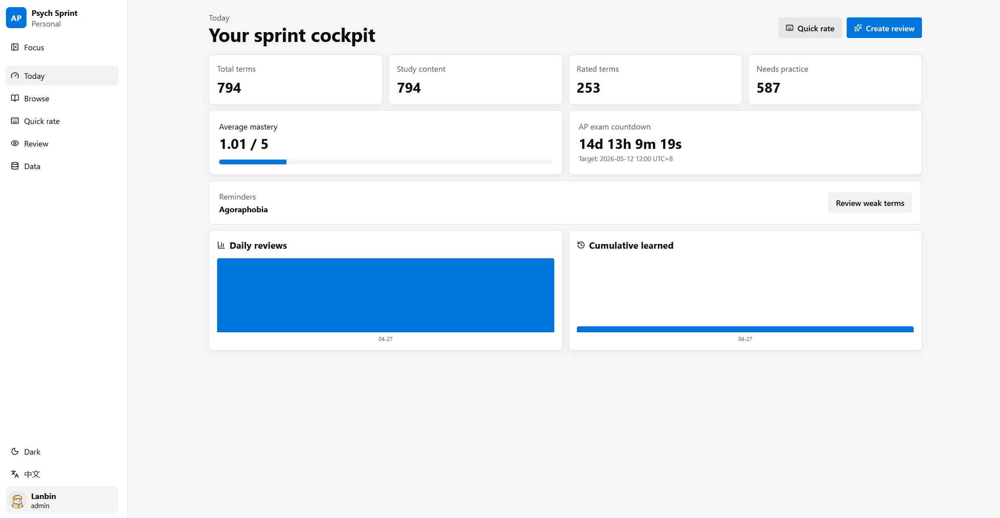
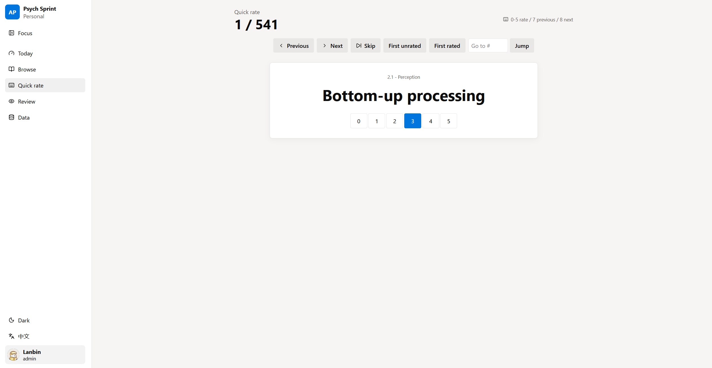
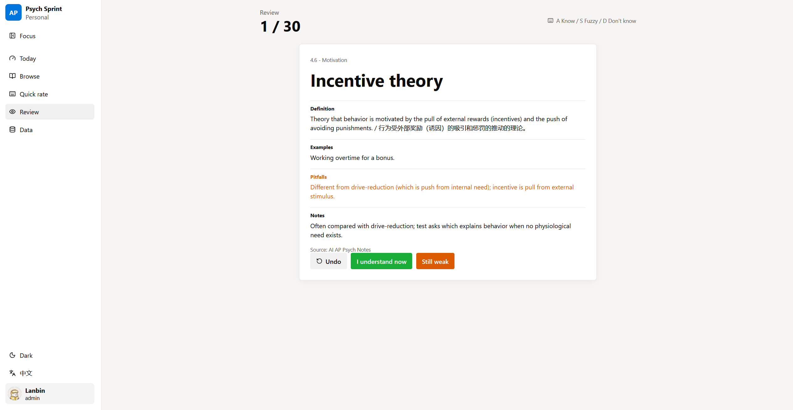
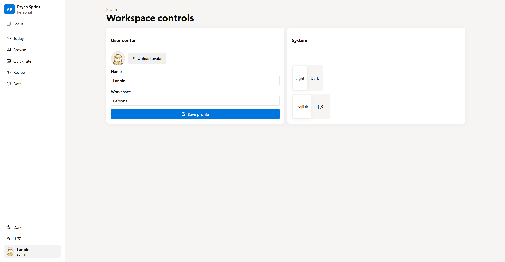
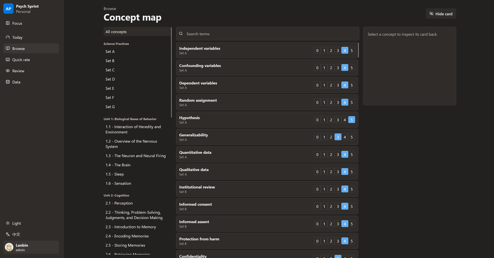

# AP Psych Final Sprint

A local-first AP Psychology sprint platform with React, Go/Gin, GORM, and SQLite.











## What It Does

- Imports the canonical AP Psychology concept list from `data/sources/keyterms.md`.
- Preserves local notes and downloaded source material under `data/sources/`.
- Supports multi-tenant registration and login.
- Separates global concept data from each user's ratings, review events, and progress.
- Restricts data import and concept-content editing to admin users.
- Lets each user rate every concept from 0 to 5.
- Provides a recognition-first review flow.
- Tracks review events and mastery changes.
- Imports compact AI enrichment from `data/sources/ai-enrichment.compact` when available.

## Run Locally

Install frontend dependencies:

```powershell
cd frontend
npm install
```

Run the backend:

```powershell
cd ..
go run .
```

Run the frontend in another terminal:

```powershell
cd frontend
npm run dev
```

Open `http://localhost:5173`.

The backend API runs on `http://localhost:8080`. On first startup, it creates `data/app.db` and imports the source data.

## Build

```powershell
cd frontend
npm run build
cd ..
go run .
```

After the frontend is built, the Go server also serves the built site from `http://localhost:8080`.

## AI Enrichment

The compact enrichment tool reads `.env`, calls the configured OpenAI-compatible chat endpoint, and writes:

```text
data/sources/ai-enrichment.compact
```

Run a small batch:

```powershell
node tools/ai-enrich.mjs --limit=20
```

Run all remaining concepts:

```powershell
node tools/ai-enrich.mjs --limit=800
```

Then re-import from the app Data page, or call:

```powershell
Invoke-RestMethod -Method Post -Uri http://localhost:8080/api/import/run -Headers @{Authorization="Bearer TOKEN"} -Body "{}" -ContentType "application/json"
```

## Tests

```powershell
go test ./...
cd frontend
npm run build
```

## Accounts And Admin Access

The login form intentionally starts blank. Register a local account on first launch.

The first registered account is created as an admin so it can access the Data page. Later accounts are regular student users unless their role is changed directly in local development.
